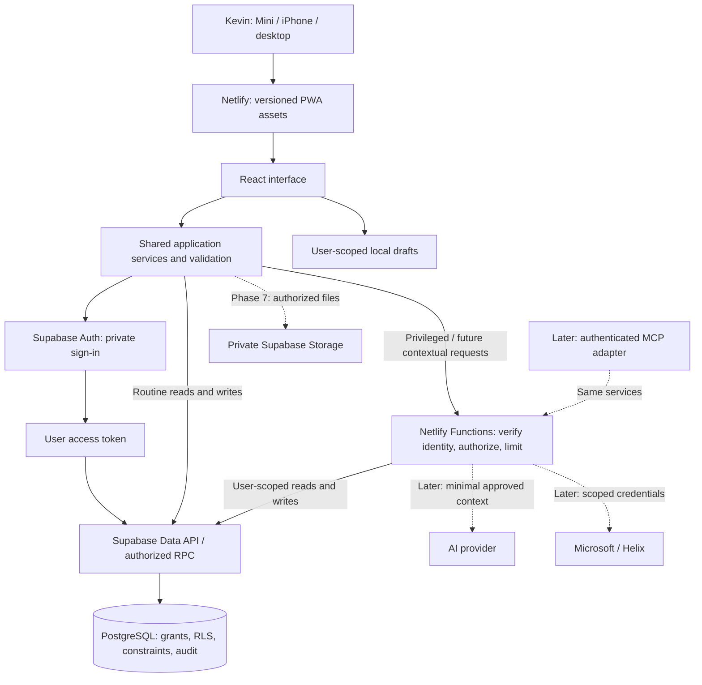

# Command — initial architecture decision

**Status:** Accepted by Kevin · September 21, 2026  
**Related:** [Build contract](PHASE-0-BUILD-CONTRACT.md) · [Master brief](COMMAND-MASTER-BRIEF.md)

## Decision

Use a React/Vite/TypeScript PWA served by Netlify, a dedicated Supabase Auth/PostgreSQL project, and a small shared TypeScript service layer. Routine operations use the user's Supabase identity and database authorization. Netlify Functions host privileged operations and later Cora/integration endpoints. Atomic multi-record work belongs in authorized database transactions/functions, not a chain of client requests.

This avoids a redundant server proxy for every Task checkbox while retaining server-side execution for secrets and privileged work. No user interface is a security boundary. Any client-callable data operation must remain safe when invoked outside the application.

## Data flow and trust boundaries



**Browser:** UI, non-authoritative validation, query state, session handling and temporary drafts. The publishable Supabase key is expected to be public; privileged keys are not. The SPA's Supabase session is browser-accessible, so preventing script injection is essential. Never render captured HTML as trusted markup, include arbitrary third-party scripts, or place external provider tokens in the browser. If future data classifications require HttpOnly session isolation, revisit a backend-for-frontend architecture before admitting that data.

**Database:** final enforcement of ownership, allowed operations, record relationships, constraints and atomic changes. A user must be both authorized for the app and the owner of the target data. Client-supplied `user_id`, role labels or metadata cannot grant authority.

**Server:** token verification, explicit authorization, validated inputs, rate/size limits, provider secrets and contextual orchestration. Prefer queries using the caller's identity. A privileged database credential is reserved for narrowly defined administrative operations; it must not turn every application request into a blanket RLS bypass.

**External systems, later:** distinct trust boundaries, separate consent/scopes and bounded data retrieval. Retrieved text is evidence, never executable instruction. All mutations use the same authorization and auditing rules regardless of UI, Cora or MCP origin.

## Authentication and authorization proposal

Provision one approved user. Disable public registration and anonymous sign-in. Keep membership/authorization in server-controlled data, not user-editable metadata. Kevin selected Supabase Authentication and explicitly deferred MFA. Email/password is the proposed sign-in method for the initial release.

Require a valid authenticated session, approved active app membership, and ownership of the requested record. Test each missing condition through direct API calls. Do not introduce an MFA-assurance check that would block the explicitly selected non-MFA sign-in flow.

Set grants, SELECT/INSERT/UPDATE/DELETE policies and supporting indexes together. Test updates cannot change ownership, and linked record IDs belong to the same owner. Review views and RPC permissions explicitly; do not use privileged functions merely to fix a permissions error. [Supabase RLS](https://supabase.com/docs/guides/database/postgres/row-level-security)

Proposed production session settings: a 12-hour maximum session, default one-hour access-token lifetime, and multiple device sessions allowed. Test the actual reauthentication flow on the Mini before acceptance. Provider session-duration limits are plan-dependent and enforced on refresh; an already-issued token can remain valid until expiry. Do not claim logout instantly revokes every token. Urgent account suspension must also remove app authorization at the data boundary. [Supabase sessions](https://supabase.com/docs/guides/auth/sessions)

Provide a documented password/account recovery path through the designated organization administrator, with identity verification, audit and session cleanup. Do not weaken RLS to recover access. Verify production invitation/password-reset delivery and approved sender configuration before pilot use. [Supabase email delivery](https://supabase.com/docs/guides/auth/auth-smtp)

## Small initial domain

| Concept | Minimum responsibilities |
|---|---|
| App membership | Approved auth identity and active access state; no user-managed roles |
| Tasks | Owner, title, details, lifecycle, priority, date, completion, version and source |
| Reminders | Owner, original wording, optional local date/time, timezone, snooze, lifecycle and conversion link |
| Captures | Owner, untouched original text, timestamps and later classification references |
| Waiting items | Owner, dependency, external party label, follow-up date, optional Task link and resolution |
| Preferences | Theme, timezone and selected priority ordering |
| Activity log | Actor, action, entity ID, time, request ID and outcome; no copied note bodies |

These are responsibilities, not final SQL schemas. Add actual columns and constraints with their feature migrations. Keep dates without a time as dates. Store instants consistently, retain timezone meaning, and resolve relative dates only when conversational interpretation is introduced.

Task/reminder writes use stable request or entity IDs so retries cannot duplicate records. Conversion from Reminder to Task is one authorized transaction: create/link the Task and transition the Reminder according to a documented rule, or change neither. Persisted activity auditing must be atomic with important writes, including writes made directly through the Data API. Clients cannot edit audit history.

## Service organization

Proposed logical layout, to be implemented in Phase 1 rather than generated now:

```text
src/app/                 routing, providers and application shell
src/features/            Work Day, Tasks, Reminders and capture UI
src/services/            application operations; no component-level SQL
src/domain/              types, validation and state-transition rules
src/data/                Supabase adapters and bounded query contracts
src/platform/            auth, draft storage, telemetry and configuration
netlify/functions/       server entry points when an operation needs them
supabase/migrations/     versioned schema, policies, grants and indexes
supabase/tests/          authorization and database behavior checks
tests/                   critical workflows and recovery checks
```

The service layer is a code boundary, not a mandatory network hop. Client and server adapters may call the same validated operations; database constraints/RLS remain authoritative even when a caller bypasses shared TypeScript code. Share domain rules rather than shipping secrets or server-only imports to the browser.

Netlify Functions provide a server execution boundary integrated with deployment. Exact runtime versions, regions and limits are implementation-time choices to verify before use. [Netlify Functions](https://docs.netlify.com/build/functions/overview/)

## Performance design

- Work Day loads a bounded core snapshot; do not download all historical Tasks or Captures. Independent lists load concurrently, or use one justified aggregate query.
- Use indexes supported by measured query patterns, including owner/status/date lookups. Do not add every possible index up front.
- Update the interface immediately for reversible actions, retain the pending state, and restore it on failure. Track persisted completion separately from perceived response.
- Keep route bundles small and defer nonessential screens. Static asset caching is separate from authenticated data caching.
- Avoid constant polling. Refresh on meaningful user activity/reconnect; deduplicate requests and mark stale data.
- Trace browser-to-database and browser-to-function latency before adding caches. Use minimal context and streaming only when Cora is introduced.

## Security and failure cases to prove

| Scenario | Required behavior |
|---|---|
| Signed-out or unapproved-user direct request | No business records returned or changed |
| Approved user queries another owner | Denied, including related records and future documents |
| Attacker changes owner/linked record IDs | Constraint/policy denial, not reliance on UI controls |
| Session expires during writing | Preserve draft, request sign-in, recheck identity before save |
| Retry after uncertain write response | One committed record/action; fetch result by stable ID |
| Two devices edit the same record | Detect version conflict and preserve both versions until resolved |
| Local storage is unavailable/full | Display failure and keep input in memory; never claim durable save |
| Network disappears | Local draft state stays explicit; existing operations never report false success |
| Supabase is unavailable | Clear unavailable/pending state; do not misrepresent cached data as current |
| Preview deploy runs | Disconnected from production; synthetic local/CI data only |
| Code deploy rolled back | Database remains compatible or a tested recovery procedure is used |

Use HTTPS, restrictive CSP and other applicable browser headers, explicit auth redirects, bounded inputs, dependency review and telemetry redaction. `noindex` reduces discovery; it is not access control. Publicly served static assets must contain no private content or secrets.

## Environment decision — Phase 1 update

Kevin directed that Command use **one hosted Supabase project, for production only**. No hosted staging database will be created. Local/CI databases are disposable test infrastructure. Netlify preview builds must not receive production Supabase configuration.

## Decisions intentionally postponed

No model choice, RAG library, vector tuning, Microsoft scopes, MCP server hosting, job scheduler, or notification provider is selected here. The initial architecture leaves those additions possible without paying their complexity cost before daily use.

**Verification boundary:** This is an architectural proposal checked against current official documentation. There is no deployed application, measured application latency, tested RLS implementation, or completed recovery drill yet.
